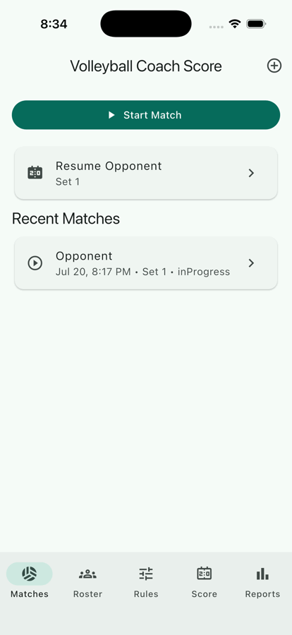

# Coach Score

Coach Score is an offline Flutter app for assistant coaches to record volleyball
player actions during a match. It tracks a custom, coach-defined score called
Coach Score. This is not an official volleyball statistic.

## Student Guides

- [Flutter environment setup for Windows and macOS](docs/flutter_environment_setup.md)
- [Coach Score HCI tutorial](docs/student_developer_tutorial.md)

## Student Quick Start

New to Flutter or software development? Complete the
[Flutter environment setup guide](docs/flutter_environment_setup.md) before
continuing. It begins with computer basics—operating systems, applications,
processes, files, folders, paths, and terminal commands—then covers Windows,
macOS, VS Code, the Flutter SDK, Chrome, Android, iOS, and common setup problems.

For the first class, use Chrome. Android Studio, an Android emulator, Xcode, and
the iOS Simulator are optional and can be configured later.

### 1. Download Coach Score

Open a terminal and run:

```sh
git clone https://github.com/rising-stars-v/volleyball_stats.git
cd volleyball_stats
```

If Git says the repository cannot be found or asks you to sign in, confirm with
your teacher that your GitHub account has access.

### 2. Check Your Development Environment

Run:

```sh
flutter doctor -v
flutter devices
```

Before continuing, confirm that:

- The `flutter` command works.
- `flutter doctor -v` recognizes Flutter, Chrome, and your code editor.
- `flutter devices` lists Chrome as a web device.

Android or Xcode warnings do not block the first Chrome lesson.

### 3. Install Packages and Run the App

From the `volleyball_stats` project folder, run:

```sh
flutter pub get
flutter run -d chrome
```

The first run may take several minutes. Coach Score should open in a new Chrome
window. Keep the terminal open while the app is running.

In the terminal:

- Press `r` to hot reload after changing code.
- Press `R` to restart the app.
- Press `q` to stop the app.

### 4. Try the Main Workflow

After the app opens:

1. Open the roster.
2. Start or resume a match.
3. Select a player.
4. Record several actions.
5. Undo one action.
6. Open the match summary.

Do not only ask, "Does it work?" Also ask, "Was it easy to use?"

### 5. Verify the Project

After stopping the app, run:

```sh
dart format .
flutter analyze
flutter test
```

The project is ready when formatting finishes, the analyzer reports no issues,
and all tests pass. If a command fails, copy the first useful error message and
use the setup guide's
[troubleshooting section](docs/flutter_environment_setup.md#troubleshooting).

Next, continue with the
[Coach Score Student HCI Tutorial](docs/student_developer_tutorial.md).

## Current MVP

- Roster management with active/inactive players and unique active jersey numbers.
- Fictional seed roster: #3 Alex, #7 Jordan, #11 Casey, #18 Taylor.
- CSV roster import with all-or-nothing validation using `jersey_number,name`.
- Custom scoring rules for serves, attacks, blocks, and errors.
- Rule snapshots on every event so old matches are not recalculated after rules change.
- Match creation, resume, current set tracking, next set, finish confirmation, and recent matches.
- Live scoring optimized for touch use: select a player, tap an action, keep the player selected, and record immediately.
- Void-based undo so mistaken entries are excluded from totals without deleting raw history.
- Match summary with Coach Score by player, action totals, set totals, positive/negative event counts, CSV export, JSON backup export, and native share where supported.
- Offline persistence on Chrome and mobile.

## Project Structure

```text
lib/
  app/              App shell, theme, and application state
  core/             CSV parsing, exports, and scoring summaries
  data/
    models/         Player, rule, match, and event models
    repositories/   StatsRepository abstraction and implementations
    storage/        Browser and mobile persistence
  features/
    home/
    roster/
    rules/
    matches/
    scoring/
    reports/
test/               Unit and widget tests
store/screenshots/  Draft screenshots for future store listings
```

## Other Run and Build Commands

Complete the Student Quick Start before using these platform-specific commands.

Run on an iOS Simulator:

```sh
flutter devices
flutter run -d <simulator-device-id>
```

Build Android release artifacts:

```sh
flutter build appbundle
flutter build apk --debug
```

## Verification

Use this before committing or preparing a release:

```sh
dart format .
flutter analyze
flutter test
```

Recent verification on this repo passed:

- `dart format .`
- `flutter analyze`
- `flutter test`
- iOS Simulator run with bundle id `com.deswang.volleyballstats`
- Android app bundle build at `build/app/outputs/bundle/release/app-release.aab`

## Store Preparation

Identifiers currently configured:

- App display name: `Coach Score`
- Android package / namespace: `com.deswang.volleyballstats`
- iOS bundle identifier: `com.deswang.volleyballstats`

Draft screenshots are stored under:

```text
store/screenshots/ios/iphone-17/
```

Animated preview:



Demo recording:

```text
store/recordings/coach-score-ios-demo-captioned.mp4
```

These screenshots are meant as reusable source material for future App Store
Connect and Google Play listings. Before final submission, regenerate screenshots
on the exact required device sizes and review current store requirements in App
Store Connect and Google Play Console.

Remaining release work before public store submission:

- Replace default Flutter launcher icons with final app icons.
- Finalize store title, subtitle, description, keywords, privacy details, and support URL.
- Create signing assets for Android and archive with Apple signing in Xcode.
- Generate final store screenshots after the UI and branding are stable.
- Test on at least one physical Android device when USB or device access is available.

## Data Notes

The app stores raw match events instead of only aggregate totals. Summary reports
are calculated from `MatchEvent` records and exclude events with `voidedAt` set.
Each event stores the action label, category, and point snapshot from the time it
was recorded.
