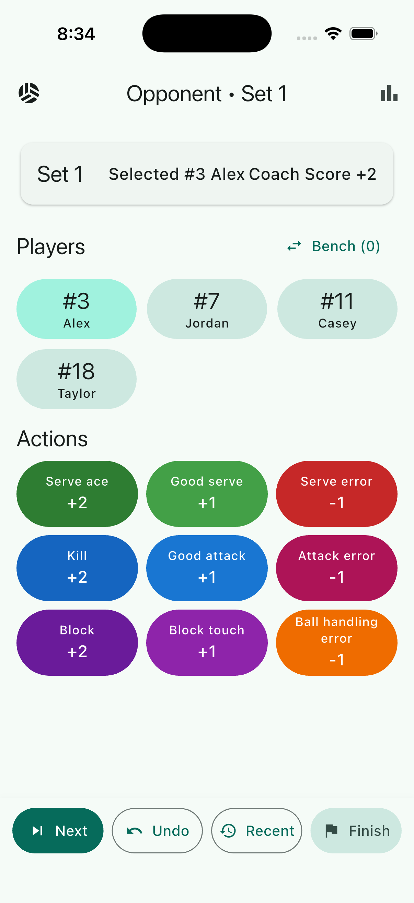
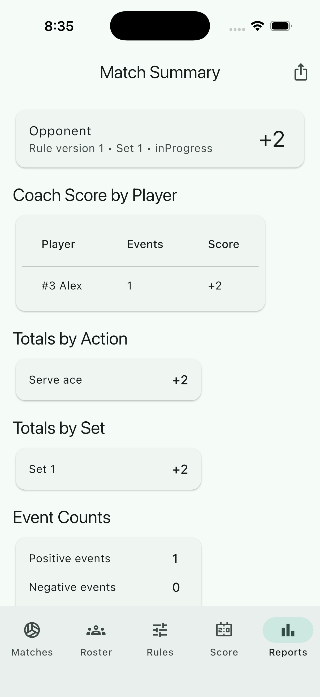
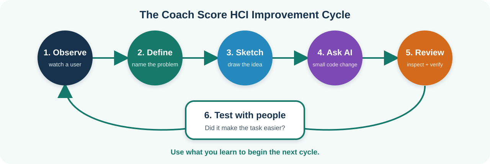

# Coach Score Student HCI Tutorial

This guide is for 8th grade students who want to help improve Coach Score by
thinking like product designers, user researchers, and human-computer
interaction reviewers.

If Flutter and the development tools are not installed yet, complete the
[Flutter Environment Setup for Students](flutter_environment_setup.md) first.

You do not need to become an expert programmer first. In this project, students
should focus on understanding the users, finding confusing moments, designing
better interactions, and using AI to help with the coding.

## What Is Coach Score?

Coach Score is a Flutter app for volleyball coaches. During a match, a coach can
select a player, tap an action, and later review a custom score summary.

The app is used in a fast, noisy, real-world environment:

- A coach may be standing near the court.
- They may only have one hand free.
- They may need to tap quickly without looking for long.
- They may make mistakes and need to undo them.
- They may need to explain results after the match.

That means the app is not just a coding project. It is an HCI project.

| Live scoring | Match summary |
| --- | --- |
|  |  |
| Designed for fast taps during a match | Designed for reviewing results after a match |

*The exact layout can look slightly different in Chrome. Notice how each screen
supports a different user goal.*

## What Is HCI?

HCI means Human-Computer Interaction. It asks questions like:

- Who is using this app?
- What are they trying to do?
- What makes the task hard?
- What information do they need first?
- What buttons are easy or hard to tap?
- What mistakes might happen?
- How can the app help users recover from mistakes?

Good HCI work makes software easier, faster, safer, and more pleasant to use.

## What You Will Learn

By the end of this tutorial, you should be able to:

- Describe the main users of Coach Score.
- Watch someone use the app and notice usability problems.
- Sketch a better screen or workflow.
- Write a clear AI prompt for a small app change.
- Review AI-generated code by testing the user experience.
- Explain your contribution using HCI language.

## The Student Role

Your main job is not to write lots of code by hand.

Your main job is to:

1. Understand the user.
2. Find a real problem.
3. Design a simple improvement.
4. Ask AI to help implement it.
5. Test whether the improvement actually helps.

AI can help write code, but AI does not automatically know what a coach needs
during a volleyball match. That is where your HCI thinking matters.



*HCI is a cycle. Testing teaches you what to observe and improve next.*

## Run The App

From the project folder, install the app packages:

```sh
flutter pub get
```

Then run the app in Chrome:

```sh
flutter run -d chrome
```

Try this short walkthrough:

1. Open the roster.
2. Start or resume a match.
3. Select a player.
4. Tap a few scoring actions.
5. Undo one action.
6. Open the match summary.

As you try the app, do not only ask, "Does it work?" Also ask, "Was it easy?"

## Project Map For Designers

You do not need to understand every file. Start with the parts that connect to
the user experience.

```text
lib/features/home/       Main entry screen
lib/features/roster/     Player list and roster management
lib/features/matches/    Start, resume, and finish matches
lib/features/scoring/    Live scoring during a match
lib/features/reports/    Match summaries and exports
lib/app/app_state.dart   Shared app actions and app memory
lib/core/                Calculations, CSV, and export helpers
test/                    Automated checks
```

For HCI work, the most important folder is:

```text
lib/features/
```

That is where the screens live.

## The Main Users

Before designing a feature, decide which user you are helping.

### Assistant Coach

The assistant coach records actions during a live match.

They care about:

- Fast taps
- Large buttons
- Few distractions
- Easy undo
- Clear player selection
- Confidence that the event was recorded

### Head Coach

The head coach reviews the summary after a match.

They care about:

- Which players performed well
- Which actions happened most
- Which set had problems
- Simple export or sharing
- Results that are easy to explain

### Team Admin Or Parent Helper

This person may help enter rosters or prepare information.

They care about:

- Clear forms
- Helpful error messages
- Easy CSV import
- Not accidentally changing match history

## HCI Observation Activity

Pair up with another student.

One student is the user. The other student is the observer.

The user should complete this task:

```text
Start a match, record three actions for two players, undo one mistake, and find
the match summary.
```

The observer should write down:

- Where did the user pause?
- What did the user tap first?
- Did the user understand which player was selected?
- Did the user notice if an action was recorded?
- Was undo easy to find?
- Did any label confuse the user?
- Did the screen feel crowded?

Important rule: do not explain the app while observing. Watch what happens
naturally.

## Usability Notes Template

Use this format when you find a problem:

```text
User:
Task:
What happened:
Why it matters:
Possible improvement:
How we can test it:
```

Example:

```text
User: Assistant coach
Task: Record a serve for #7 Jordan
What happened: The user tapped the action before noticing the wrong player was selected.
Why it matters: During a real match, this could record points for the wrong player.
Possible improvement: Make the selected player more obvious near the action buttons.
How we can test it: Ask three students to record actions and see if they notice the selected player before tapping.
```

## Design Before Coding

Before asking AI to code, make a small design plan.

Answer these questions:

- Who is this change for?
- What problem does it solve?
- Where will the user see it?
- What should happen when the user taps, types, or scrolls?
- What mistake could the user make?
- How will the app help the user recover?
- How will we know the change worked?

If you cannot answer these questions, the feature idea is not ready for coding
yet.

## Sketch The Idea

You can sketch on paper, a whiteboard, or a simple drawing tool.

Your sketch should show:

- The screen name.
- The most important information.
- The buttons or controls.
- What changes after the user takes an action.
- Any error or empty state.

The sketch does not need to be beautiful. It needs to make the idea clear.

## Good HCI Contribution Ideas

Beginner ideas:

- Make the selected player easier to see on the scoring screen.
- Improve the empty message when there is no active match.
- Rename a confusing button or label.
- Add a clearer success message after importing a roster.
- Make an error message explain how to fix the problem.

Intermediate ideas:

- Add a roster search or filter.
- Add a "recently recorded" confirmation near the action buttons.
- Improve the match summary layout so the most important numbers are first.
- Add a safer confirmation step before finishing a match.
- Make CSV import errors easier for a student manager to understand.

Advanced ideas:

- Design a better one-handed scoring layout.
- Add a simple post-match coach review workflow.
- Add a set-by-set comparison view.
- Improve accessibility for larger text and screen readers.
- Design a first-time user onboarding flow.

## Using AI For Coding

AI works best when you give it a clear HCI problem, not just a vague command.

Weak prompt:

```text
Make the scoring screen better.
```

Better prompt:

```text
In this Flutter app, improve the live scoring screen for an assistant coach who
needs to record actions quickly during a volleyball match. Make the currently
selected player more obvious near the action buttons. Keep the change small and
consistent with the existing Material design. After editing, run dart format,
flutter analyze, and flutter test.
```

Best prompt:

```text
We observed that users sometimes tap an action before noticing the wrong player
is selected. In lib/features/scoring/scoring_screen.dart, add a compact selected
player banner above the action buttons on the mobile scoring layout. The banner
should show jersey number, player name, and current player score. Keep it easy to
read with one hand during a match. Do not change storage or scoring rules. Add or
update tests only if existing tests cover this screen. Run dart format, flutter
analyze, and flutter test.
```

Notice what the best prompt includes:

- The user
- The observed problem
- The file or screen
- The expected design
- What not to change
- How to verify the work

## AI Prompt Template

Copy this template when asking AI to help:

```text
Project: Coach Score Flutter app

User:

Observed problem:

Screen or workflow:

Design goal:

Constraints:
- Keep the change small.
- Match the existing app style.
- Do not change unrelated features.
- Do not change storage unless required.

Files to inspect first:

Acceptance criteria:
- 
- 
- 

Verification:
- dart format .
- flutter analyze
- flutter test
```

## HCI Review Checklist

After AI changes the app, test the experience like a user.

Ask:

- Can I tell what screen I am on?
- Is the most important action easy to find?
- Is the selected player obvious?
- Are buttons large enough to tap quickly?
- Can I recover from a mistake?
- Are labels clear to someone new?
- Does the screen still work on a small phone size?
- Does the app avoid showing too much at once?
- Did the change solve the original problem?

Do not accept AI code just because it runs. The design still has to make sense.

## Testing With People

A simple usability test can take five minutes.

Give someone a task:

```text
Record a positive action for #7 Jordan, record a negative action for #11 Casey,
undo the last mistake, and find the total score.
```

Do not tell them where to tap unless they are completely stuck.

Write down:

- Time to finish
- Mistakes made
- Questions they asked
- Labels they misunderstood
- One thing that worked well
- One thing to improve

Then decide whether your design helped.

## Basic Code Awareness

You do not need to memorize the whole codebase, but you should know what kind of
file AI is changing.

Common Flutter widgets:

- `Scaffold`: a full page layout
- `AppBar`: the top bar
- `Text`: words on the screen
- `IconButton`: a button with an icon
- `FilledButton`: a main action button
- `ListView`: a scrollable list
- `Column`: items stacked from top to bottom
- `Row`: items arranged from left to right

When AI changes a screen, open the file and look for the `build` method. That is
where Flutter describes what the user sees.

## Contribution Checklist

Before sharing your work, make sure you can answer:

- What user did we help?
- What problem did we observe?
- What design change did we make?
- Why is this easier for the user?
- What did we ask AI to code?
- How did we test it?
- What would we improve next?

Then run:

```sh
dart format .
flutter analyze
flutter test
```

Your contribution is ready when:

- The app still runs.
- The HCI problem is easier than before.
- The code checks pass.
- You can explain the change in two or three sentences.

## Example Student Contribution

Title:

```text
Make selected player easier to see during live scoring
```

Observation:

```text
Two users tapped action buttons without checking which player was selected.
```

Design idea:

```text
Show a selected-player banner directly above the action buttons on the mobile
scoring screen.
```

AI request:

```text
Please add a compact selected-player banner to the mobile scoring screen. It
should show jersey number, name, and current score. Keep the existing app style
and do not change scoring logic.
```

Test:

```text
Ask three users to record actions for two different players. Watch whether they
notice the selected player before tapping an action.
```

## Project Rule

Start with the human problem. Then design the interaction. Then ask AI to help
with the code.

Good software is not only about making the computer work. It is about helping
people do their real task with less confusion and fewer mistakes.
