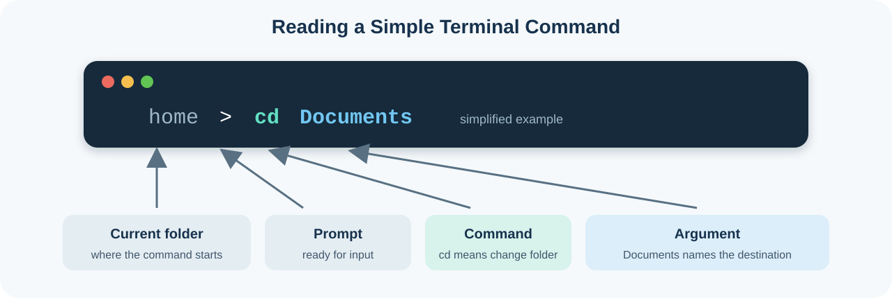

# Lesson 2: Terminal and Development Tools

**Time:** 30 minutes

**Goal:** Use a terminal to find and read the text file created in Lesson 1.

**Before starting:** Confirm that `my-first-file.txt` exists in Documents. If
it does not, complete the file activity in [Lesson 1](01-computer-basics.md).

## Lesson Plan

| Time | Activity |
| ---: | --- |
| 0–3 min | Compare visual and text interfaces |
| 3–8 min | Learn five terminal words |
| 8–10 min | Open PowerShell or Terminal |
| 10–17 min | Navigate to Documents and list its files |
| 17–21 min | Read `my-first-file.txt` safely |
| 21–25 min | Compare the terminal with Finder/File Explorer |
| 25–28 min | Preview development tools and review safety |
| 28–30 min | Exit checkpoint |

## What You Will Learn

- Explain terminal, shell, command, argument, and current folder.
- Navigate to Documents using text commands.
- List files and read a text file without changing it.
- Recognize the jobs of VS Code, Git, Flutter, and Chrome.
- Stop before running unsafe or unexplained commands.

## Visual Interface and Text Interface — 3 Minutes

In Lesson 1, you used Finder or File Explorer. You selected folders and files
through a **visual interface**.

A terminal is a **text interface**. Instead of selecting a folder icon, you
type a command such as `cd Documents`. Both interfaces ask the operating system
to work with the same folders and files.

| Visual interface | Text interface |
| --- | --- |
| Select a folder icon | Enter a command to change folders |
| See files as icons or rows | Enter a command to list files |
| Double-click a text file | Enter a command to display its text |

## Five Terminal Words — 5 Minutes

| Word | Meaning |
| --- | --- |
| **Terminal** | The window that displays a prompt, commands, and results |
| **Shell** | The program that reads a command and asks the operating system to run it |
| **Command** | A text instruction, such as `cd` or `ls` |
| **Argument** | Information supplied to a command, such as the folder name in `cd Documents` |
| **Current folder** | The folder where the next command will run |



Do not type the prompt symbol shown in examples. Type only the command that
comes after it.

## Open the Terminal — 2 Minutes

### Windows

1. Open the **Start** menu.
2. Search for `PowerShell`.
3. Open **Windows PowerShell** or **PowerShell**.

### macOS

1. Open Spotlight with **Command+Space**.
2. Search for `Terminal`.
3. Open **Terminal**.

The terminal displays a prompt when it is ready for a command.

## Activity: Find the Text File — 7 Minutes

Choose the commands for your operating system. Enter one command at a time and
look at the result before continuing.

### Windows PowerShell

Show the current folder:

```powershell
Get-Location
```

Go to Documents:

```powershell
cd "$HOME\Documents"
```

List the folder's contents:

```powershell
Get-ChildItem
```

Look for `my-first-file.txt` in the result.

If PowerShell says the Documents path does not exist, open Documents in File
Explorer, select its address bar, copy the path, and enter:

```powershell
cd "paste-the-copied-path-here"
```

### macOS Terminal

Show the current folder:

```sh
pwd
```

Go to Documents:

```sh
cd ~/Documents
```

List the folder's contents:

```sh
ls
```

Look for `my-first-file.txt` in the result.

## Activity: Read the File — 4 Minutes

These commands display the file without editing or deleting it.

Windows PowerShell:

```powershell
Get-Content .\my-first-file.txt
```

macOS Terminal:

```sh
cat my-first-file.txt
```

The terminal should display:

```text
This is my first text file.
```

What happened?

1. The shell read your command.
2. The current folder told it where to look.
3. The filename was an argument telling the command which file to read.
4. The terminal displayed the result as feedback.

If the file is not found, do not create random copies. Check the current folder
and filename first.

## Exercise: Compare the Interfaces — 4 Minutes

Complete this with a partner:

| Task | Finder or File Explorer | Terminal |
| --- | --- | --- |
| Open Documents | Select the Documents folder | `cd` to Documents |
| See its files | Look at icons or rows | `ls` or `Get-ChildItem` |
| Read the text file | Double-click it | `cat` or `Get-Content` |
| Know the current folder | Read the window or address bar | `pwd` or `Get-Location` |

Discuss: which interface gives a beginner clearer feedback? Which might become
faster for repeated work? Neither answer has to be the same for every person.

## Development Tools and Safety — 3 Minutes

You do not need to run these tools yet. Lesson 3 will install them.

| Tool | Its future job |
| --- | --- |
| **VS Code** | Read and edit project files |
| **Git** | Download a project and track versions |
| **Flutter SDK** | Create, run, check, and build Flutter applications |
| **Chrome** | Run the web version of Coach Score |

Safety rules:

- Read the entire command before pressing Enter.
- Confirm the current folder before running a command.
- Do not paste commands that request passwords, tokens, or private information.
- Stop before commands involving delete, remove, publish, deploy, or payment.
- An error is information. Read it before trying another command.

## Exit Checkpoint — 2 Minutes

Show your teacher or partner that you can:

1. Display the current folder.
2. Navigate to Documents.
3. List the files and find `my-first-file.txt`.
4. Display the sentence stored inside it.
5. Explain which part was a command and which part was an argument.

## What Comes Next

Continue to [Lesson 3: Install Flutter](03-install-flutter.md).
