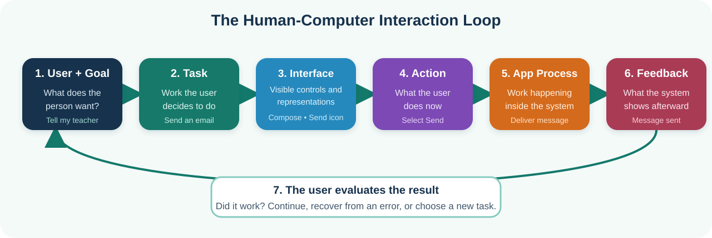
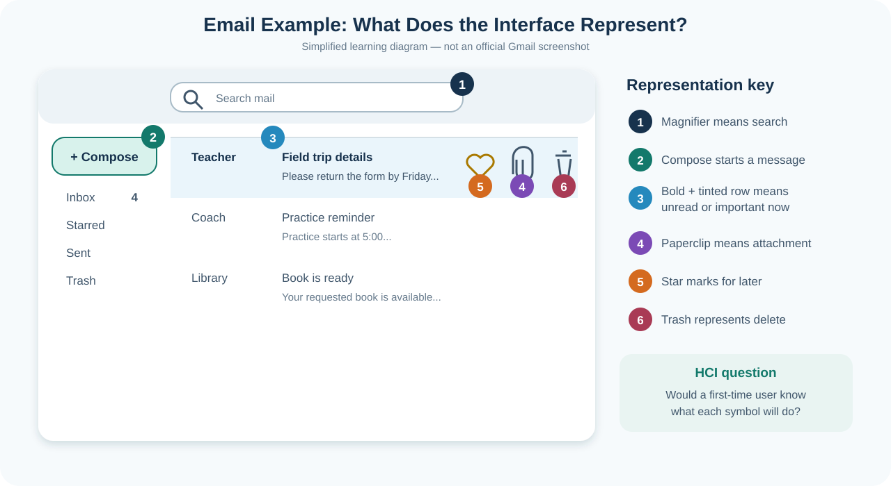
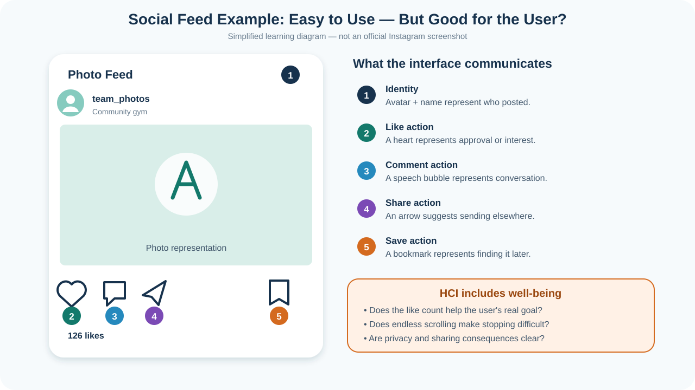

# Lesson 6: HCI Basics Through Everyday Apps

**Time:** 60 minutes

**Goal:** Use familiar email and social-photo examples to understand the HCI
language needed to study Coach Score.

This beginner tutorial uses familiar email and social-photo apps to explain
Human-Computer Interaction (HCI). We will use Gmail and Instagram as examples,
but the ideas apply to almost every app—including Coach Score.

You do **not** need an email or social-media account for these activities. Use
the diagrams, paper, or a teacher-provided demonstration. Do not show private
messages, contact information, passwords, or personal photos.

> **About the examples:** Gmail and Instagram are named only as familiar
> examples. The diagrams below are original, simplified learning diagrams—not
> official screenshots. Real interfaces change over time.

## Lesson Plan

| Time | Activity |
| ---: | --- |
| 0–8 min | Introduce the email story and HCI loop |
| 8–18 min | Application, interface, and representation |
| 18–28 min | Goal, task, process, and action |
| 28–38 min | Feedback, state, errors, and recovery |
| 38–48 min | Social-photo example and well-being discussion |
| 48–57 min | Apply the vocabulary to Coach Score |
| 57–60 min | Quick check and exit checkpoint |

For a 60-minute class, complete the numbered activities as short partner or
group discussions. Students may write only one strong answer when an activity
offers several prompts. Use the remaining prompts as optional extra practice.

## What You Will Learn

By the end of this tutorial, you should be able to:

- Explain the difference between an application and an interface.
- Identify a user's goal, task, actions, and process.
- Explain what an icon, color, label, or layout represents.
- Find feedback that tells the user what happened.
- Notice possible errors and ways to recover.
- Evaluate whether an interface supports the user's needs and well-being.
- Apply these ideas to Coach Score.

## Part 1: One Story, Many HCI Ideas

Imagine this story:

> Maya wants to tell her teacher that her science assignment is complete. She
> opens an email app, creates a message, attaches the file, and sends it. The app
> displays “Message sent.”

The story contains several different HCI ideas:

| HCI idea | Plain-language meaning | Maya's email example |
| --- | --- | --- |
| **User** | The person interacting with technology | Maya |
| **Goal** | The result the person wants | Tell her teacher the work is complete |
| **Application (app)** | The whole software product or service | The email application, such as Gmail |
| **Interface** | The parts the user sees, hears, touches, or controls | Inbox, Compose button, message form, Send button |
| **Representation** | Something that stands for information or an action | A paperclip stands for “attach a file” |
| **Task** | A piece of work the user chooses to do | Send an email with the assignment attached |
| **Process or workflow** | The ordered steps that complete the task | Compose → address → attach → review → send |
| **Action** | One thing the user does | Select the paperclip icon |
| **System operation** | Work the application does internally | Upload the file and deliver the message |
| **Feedback** | What the system shows after an action | Upload progress and “Message sent” |
| **State** | What is true in the app right now | Draft, uploading, sent, or failed |
| **Context** | The situation in which the app is used | At school, on a laptop, before a deadline |

The words are related, but they are not interchangeable. A **goal** is not a
button. A **task** is not the whole application. An **action** is usually one
small step inside a process.



The user and computer take turns. The user acts, the application responds, and
the user decides whether the result matches the goal.

## Part 2: Application, Interface, and Representation

These three terms are easy to mix up.

### Application

An **application** is the whole software product. Gmail is an email application.
It includes more than one screen and performs work that the user cannot see,
such as storing drafts and delivering messages.

Think of an application as a whole school building.

### Interface

An **interface** is the part through which a user and a system communicate. An
inbox screen is one interface inside an email application. Buttons, fields,
menus, sounds, and vibration can all be parts of an interface.

Think of an interface as the doors, signs, desks, and intercoms that let people
use the school building.

### Representation

A **representation** stands for something else. A trash-can icon represents
deleting. Bold text may represent an unread message. A red badge may represent
new activity.

Representations help people understand a system quickly—but only when people
can correctly guess their meaning.



### Activity 1: Read the Email Interface

Without selecting anything, answer these questions:

1. Which part is the interface: the entire email service, or the visible inbox?
2. What does the paperclip represent?
3. What might bold text and a tinted row communicate?
4. Which control looks like it will begin a new task?
5. Which representations depend on knowledge you learned somewhere else?

There can be more than one reasonable answer. HCI is partly about discovering
whether real users understand a design—not merely whether the designer thinks
it is obvious.

## Part 3: Goal, Task, Process, and Action

Start with what the person wants, then become more specific:

```text
Goal: Tell my teacher the assignment is complete.
  Task: Send an email with the assignment attached.
    Process: Compose → enter recipient → write → attach → review → send.
      Action: Select the paperclip icon.
```

One goal can have several possible tasks. Maya might send an email, submit the
file in a class website, or hand the teacher a printed copy. One task also
contains several actions.

### Activity 2: Build a Task Ladder

Choose one goal:

- Ask a coach what time practice begins.
- Send a family member a photo.
- Find an unread message from a teacher.

Write four lines:

```text
Goal:
Task:
Process:
One action:
```

Check your work: the goal should describe an outcome, and the action should be
something a person can do now, such as select, type, drag, swipe, or speak.

## Part 4: Feedback, State, Errors, and Recovery

An interface should answer two questions:

1. **What can I do?**
2. **What happened after I did it?**

Suppose Maya selects **Send**. The app might show a spinner, disable the Send
button briefly, and then display “Message sent.” Those are forms of feedback.
They help Maya understand the application's state.

| User action | Possible system operation | Useful feedback |
| --- | --- | --- |
| Select a file | Upload the attachment | File name, progress, and upload-complete mark |
| Select Send | Deliver the message | “Sending…” followed by “Message sent” |
| Enter a bad address | Check the recipient | Explain which address needs attention |
| Remove a draft | Mark it for deletion | Move it to Trash and offer Undo |

Good interfaces also support **recovery**. People make mistakes, especially
when they are rushed or learning.

### Activity 3: Find the Recovery Path

Choose **one** problem and describe helpful feedback and a recovery action.
Early finishers may discuss the others:

1. Maya selects the wrong person suggested by autocomplete.
2. Maya writes “I attached my work” but forgets the file.
3. The internet disconnects while the file is uploading.
4. Maya selects Send too early.

Do not blame the user. Ask how the design can prevent the mistake, make it
visible, or make it easy to undo.

## Part 5: A Social-Photo App Example

Now imagine:

> Leo wants to see a friend's volleyball-team photo. He opens a social-photo
> app, scrolls to the post, and selects the heart. The heart changes appearance
> and the like count changes.

The application could be Instagram. The visible feed is an interface. The
heart is a representation. Scrolling and selecting the heart are actions. The
changed heart is feedback.



### Activity 4: Complete the HCI Map

Complete the Goal, Interface, Action, Representation, and Feedback rows during
class. Finish the other rows only if time permits:

| HCI idea | Your answer |
| --- | --- |
| User | Leo |
| Goal |  |
| Application |  |
| Interface |  |
| Task |  |
| Process |  |
| One action |  |
| One representation |  |
| Feedback |  |
| State before and after |  |

### Easy to Use Is Not the Only Goal

HCI also asks whether a design respects people's attention, privacy, safety,
accessibility, and well-being.

Discuss these questions:

- Does a like count help Leo reach his real goal, or can it create pressure?
- Does endless scrolling make it difficult to choose when to stop?
- Is it clear who can see a shared photo?
- Can a person use the interface without seeing color or hearing sound?
- What happens if someone taps Like by mistake?

A design can be fast and attractive while still creating problems for users.
Good HCI considers both usability and consequences.

## Optional Vocabulary

When you are ready, the
[advanced HCI concepts reference](reference/advanced-hci-concepts.md) explains
affordance, signifier, mapping, constraint, and mental model. Those words are
helpful, but you do not need to memorize them before continuing.

## Part 6: Apply the Ideas to Coach Score

Coach Score uses the same HCI building blocks:

| HCI idea | Coach Score example |
| --- | --- |
| User | An assistant coach beside the court |
| Goal | Keep an accurate record during a match |
| Application | Coach Score |
| Interface | Live scoring screen |
| Representation | Highlighted player, jersey number, score, action buttons |
| Task | Record a serve ace for player #7 |
| Process | Select #7 → select Serve Ace → check feedback → continue |
| Action | Tap the Serve Ace button |
| System operation | Save a scoring event and recalculate the summary |
| Feedback | Recent-event list and score change |
| Recovery | Undo an incorrect event |
| Context | A fast, noisy gym; the coach may have one hand free |

### Activity 5: Compare the Applications

As a class, choose one representation or interaction from each application.
Complete at least the first three rows; the remaining rows are extra practice:

| Question | Email | Social feed | Coach Score |
| --- | --- | --- | --- |
| What is represented? | Attachment | Like | Selected player |
| How is it represented? | Paperclip | Heart | Your answer |
| What action does the user take? | Your answer | Your answer | Your answer |
| What feedback appears? | Your answer | Your answer | Your answer |
| What mistake is possible? | Your answer | Your answer | Your answer |
| How can the user recover? | Your answer | Your answer | Your answer |

## Quick Check

Match each example to a term. Answers are below.

1. “Send my completed assignment to my teacher.”
2. Selecting the paperclip.
3. The entire email product.
4. A paperclip that means attachment.
5. “Message sent.”
6. Compose → address → attach → review → send.
7. The visible inbox and message controls.
8. The app uploading the file.

Terms: **action, application, feedback, goal, interface, process,
representation, system operation**.

<details>
<summary>Show sample answers</summary>

1. Goal
2. Action
3. Application
4. Representation
5. Feedback
6. Process
7. Interface
8. System operation

Activity 1: the visible inbox is the interface; the paperclip represents an
attachment; bold/tinted mail may represent unread or important-now status; the
Compose control begins a new-message task. Icon meanings such as a paperclip or
trash can usually depend on learned conventions.

Activity 3 examples: show the full recipient and allow removal; remind the user
about a possible missing attachment; show upload failure and Retry; offer Undo
Send. Other designs may also be reasonable.

Activity 4 example: Leo's goal is to see a friend's team photo; the application
is a social-photo app; the feed is the interface; finding and reacting to the
photo is the task; open → scroll → inspect → like is the process; selecting the
heart is an action; the heart represents Like; a filled heart and changed count
are feedback; the post changes from not liked to liked.

</details>

## Student Completion Checklist

- [ ] I can distinguish an application from an interface.
- [ ] I can identify a representation and explain its meaning.
- [ ] I can separate a goal, task, process, and action.
- [ ] I can find system feedback and describe the current state.
- [ ] I can suggest prevention or recovery for a possible error.
- [ ] I can discuss accessibility, privacy, attention, or well-being.
- [ ] I can apply the same HCI vocabulary to Coach Score.

## What Comes Next

Continue to [Lesson 7: Observe Coach Score](07-observe-coach-score.md). You will
observe a real workflow, sketch an improvement, and test whether your design
helps before using AI as an optional coding assistant.
