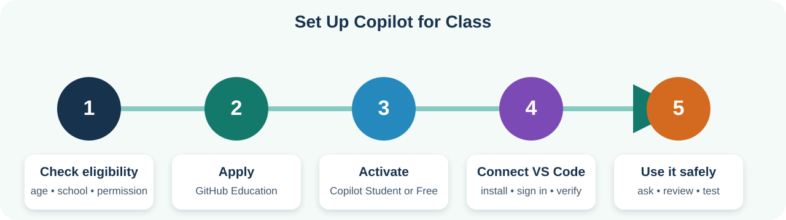

# GitHub Copilot Setup for Students

This tutorial helps new developers apply for GitHub Education, activate GitHub
Copilot Student or Copilot Free, connect Copilot to Visual Studio Code, and use
an AI coding agent safely in the Coach Score project.

Complete the
[Flutter Environment Setup for Students](complete-flutter-environment-setup.md) first.
You should already have Git, VS Code, Flutter, Chrome, and Coach Score on your
computer.

## What You Will Accomplish

By the end of this tutorial, you will:

- Understand the difference between Copilot Student and Copilot Free.
- Check whether you qualify for GitHub Education.
- Apply for student benefits when eligible.
- Activate Copilot on your GitHub account.
- Sign in to Copilot from VS Code.
- Configure recommended privacy and safety settings.
- Practice Ask, Plan, and Agent workflows.
- Review AI changes instead of accepting them blindly.
- Verify changes with Flutter's development checks.



*Complete the steps from left to right. You can use Copilot Free while waiting
for a GitHub Education application.*

## Important Rules for Student Accounts

GitHub requires account holders to be at least 13 years old. A country can
require a higher minimum age.

To qualify for GitHub Education student benefits, you must:

- Be at least 13 years old.
- Have your own GitHub personal account.
- Be enrolled in a degree- or diploma-granting program, such as a high school
  or qualifying homeschool program.
- Provide current proof that you are a student.

Some eighth-grade students might not qualify yet because of their age or school
program. That is okay. Eligible students can use **Copilot Student**. Other
students who are allowed to have a GitHub account can start with
**Copilot Free**.

Never create an account using another person's age or identity. Never share one
GitHub login among several students.

Before using an AI service for class:

- Follow your school or program's technology policy.
- Ask a parent or guardian when permission is required.
- Use only your own approved account.
- Do not upload private student information.

Official eligibility details:

- [Apply to GitHub Education as a student](https://docs.github.com/en/education/about-github-education/github-education-for-students/apply-to-github-education-as-a-student)
- [GitHub Education terms](https://docs.github.com/en/education/about-github-education/github-education-for-students/github-terms-and-conditions-for-the-student-developer-pack)

## Part 1: Create and Prepare a GitHub Account

Skip this part if you already have your own GitHub account.

### Step 1: Create the Account

1. Open [GitHub](https://github.com/).
2. Select **Sign up**.
3. Enter an email address you can access.
4. Create a strong, unique password.
5. Choose a professional username that you are comfortable using for school
   projects.
6. Complete GitHub's account-verification steps.
7. Open the verification email from GitHub and verify your email address.

Do not put your birth date, school schedule, phone number, or home address in
your public GitHub profile.

### Step 2: Add a School Email When Available

If your school gives you an academic email address:

1. Sign in to GitHub.
2. Select your profile picture in the upper-right corner.
3. Select **Settings**.
4. Select **Emails**.
5. Add your school email address.
6. Open the verification message sent to that address.
7. Complete the verification.

Keep a personal email on the account as well when your school permits it.
Students can lose access to a school email after leaving the school.

### Step 3: Protect the Account

Use a password manager if one is available. Turn on two-factor authentication
with help from a parent, guardian, or teacher.

Never send anyone:

- Your GitHub password.
- A two-factor authentication code.
- A personal access token.
- A password-reset link.
- A recovery code.

Your teacher does not need any of these secrets to help you.

## Part 2: Choose Copilot Student or Copilot Free

### Copilot Student

Choose this path if you meet GitHub Education's requirements. Verified students
receive Copilot features without paying for an individual subscription.

The application and activation are separate:

1. Apply to GitHub Education.
2. Wait for approval.
3. Activate Copilot Student from your benefits page.

Approval does not automatically mean Copilot is already activated.

### Copilot Free

Choose Copilot Free when:

- You are allowed to use GitHub but do not qualify for GitHub Education.
- Your Education application is still being reviewed.
- You want to begin the setup lesson immediately.

Copilot Free has lower monthly usage limits, but its VS Code chat and agent
features are enough for small classroom exercises.

You do not need a credit card for Copilot Free. Do not select a paid upgrade
unless a parent, guardian, teacher, or program administrator has explicitly
approved it.

## Part 3: Apply to GitHub Education

Skip this part if you are using only Copilot Free.

### Step 1: Prepare Proof of Enrollment

GitHub accepts documents such as:

- A school ID showing a current enrollment date.
- A current class schedule.
- A transcript.
- An enrollment-verification letter.

The document should clearly show your name, school, and current enrollment.
Follow GitHub's instructions about acceptable documents. Do not post the
document in the project repository or class chat.

### Step 2: Start the Application

1. Sign in to the correct personal GitHub account.
2. Open [GitHub Education benefits](https://github.com/settings/education/benefits).
3. Under **GitHub Education**, select **Start an application**.
4. Enter your school information.
5. Use your verified school email if GitHub requests it.
6. Provide the requested proof of current student status.
7. Review the information carefully.
8. Submit the application.

If your school does not provide student email addresses, GitHub's application
instructions explain how to provide other official documentation.

### Step 3: Wait for the Result

Check:

- The email address connected to your GitHub account.
- The [Education benefits page](https://github.com/settings/education/benefits).

Do not submit repeated applications while one is still being reviewed. If an
application is rejected, read the reason and correct that specific issue before
trying again.

You can continue with Copilot Free while waiting.

## Part 4: Activate Copilot

### Activate Copilot Student

After GitHub Education approves your application:

1. Open [GitHub Education benefits](https://github.com/settings/education/benefits).
2. Find **Free GitHub developer resources for students and teachers**.
3. Select **Learn more** for the Copilot benefit.
4. Follow the prompts to activate **Copilot Student**.
5. Read each Copilot policy choice before accepting it.
6. Return to your GitHub Copilot settings and confirm that Copilot is active.

GitHub reevaluates student eligibility periodically. Keep your enrollment
information current.

### Activate Copilot Free

If you are not using Copilot Student, VS Code can enroll your GitHub account in
Copilot Free during the sign-in process:

1. Open VS Code.
2. Select the Copilot icon.
3. Select **Use AI Features**.
4. Sign in to your GitHub account.
5. Follow the prompts for Copilot Free.

Read every plan screen. The selected plan should say **Free** and should not ask
you to approve a paid subscription.

Official activation instructions:

- [Access Copilot for free as a student](https://docs.github.com/en/copilot/how-tos/copilot-on-github/set-up-copilot/enable-copilot/set-up-for-students)
- [Copilot plans](https://docs.github.com/en/copilot/get-started/plans)

## Part 5: Configure Privacy Before Coding

GitHub can provide different policy choices depending on your plan and school.
Follow the stricter rule when your teacher's instructions differ from this
guide.

### Disable AI Model Training for a Personal Plan

For Copilot Free or another individual plan:

1. Sign in to GitHub in a browser.
2. Select your profile picture.
3. Select **Copilot settings**.
4. Find **Allow GitHub to use my data for AI model training**.
5. Select **Disabled**.

If this choice does not appear, your account might be managed by an organization
with different policies. Ask your teacher or administrator.

GitHub documents this setting in
[Managing Copilot policies](https://docs.github.com/en/copilot/how-tos/manage-your-account/manage-policies).

### Classroom Privacy Rules

Never give Copilot:

- Passwords or authentication codes.
- GitHub personal access tokens.
- API keys.
- `.env` file contents.
- Private student records.
- Home addresses, phone numbers, or personal schedules.
- Information about another student without permission.

An AI agent can read open files and other project files for context. Before
opening a folder in VS Code, make sure that folder does not contain unrelated
personal documents.

## Part 6: Connect Copilot to VS Code

### Step 1: Open the Correct Project

Open VS Code, then select **File > Open Folder** and choose the
`volleyball_stats` folder.

The Explorer should show:

```text
README.md
pubspec.yaml
lib/
test/
```

If VS Code asks whether you trust the authors of the files, confirm only when
the project came from your teacher or the official Coach Score repository.

### Step 2: Install or Enable Copilot

Try the built-in setup first:

1. Find the Copilot icon in the VS Code Status Bar or title area.
2. Hover over or select it.
3. Select **Use AI Features**.
4. Select **Continue with GitHub** when asked how to sign in.

If the Copilot option is missing:

1. Open **Extensions** in VS Code.
2. Search for `GitHub Copilot`.
3. Confirm that the publisher is **GitHub**.
4. Install or enable the official extension.
5. Restart VS Code.

Do not install a similarly named extension from an unknown publisher.

### Step 3: Authorize VS Code

1. VS Code opens a GitHub page in your browser.
2. Check that the browser is signed in to the same GitHub account that has
   Copilot Student or Copilot Free.
3. Review the authorization request.
4. Authorize VS Code.
5. Return to VS Code.

You might be asked to open a link or enter a one-time device code. Enter that
code only on the official GitHub page opened by VS Code.

### Step 4: Confirm the Connection

1. Select the Copilot or Chat icon.
2. Open a new chat.
3. Enter:

   ```text
   Say hello and explain which project folder you can currently see.
   Do not edit any files.
   ```

4. Confirm that Copilot identifies the `volleyball_stats` workspace.

The current official setup path is documented in
[Set up GitHub Copilot in VS Code](https://code.visualstudio.com/docs/setup/copilot).

## Part 7: Understand Ask, Plan, and Agent

Open VS Code's Chat view by selecting its Chat icon. On Windows you can also use
`Ctrl+Alt+I`. On macOS you can use `Control+Command+I`.

The mode selector appears near the chat input.

| Mode | What it should do | Start here? |
| --- | --- | --- |
| **Ask** | Explain code and answer questions without taking over the task | Yes |
| **Plan** | Investigate the project and propose steps before implementation | After Ask |
| **Agent** | Edit files, run tools, and execute terminal commands with approval | After reviewing a plan |

The names and location of controls can change as VS Code is updated. The
important idea is the level of authority you give the AI.

### Required Classroom Permission Setting

Keep the permission level on **Default Approvals**.

Do not use:

- **Bypass Approvals**
- **Autopilot**
- `/yolo`
- `/autoApprove`

These choices can allow an agent to edit files, run terminal commands, or access
external services without stopping for your review. They are not appropriate
for this beginner class.

VS Code explains these controls in
[Manage approvals and permissions](https://code.visualstudio.com/docs/agents/approvals).

## Part 8: Complete Your First Copilot Exercises

Complete these exercises in order. Do not begin by asking Copilot to build an
entire feature.

### Exercise 1: Ask for an Explanation

Choose **Ask** and enter:

```text
I am a new Flutter student. Explain lib/main.dart in plain language.
Tell me what starts the application and where the first screen comes from.
Do not edit any files.
```

After Copilot answers:

1. Open `lib/main.dart`.
2. Compare the answer with the actual code.
3. Ask about any word you do not understand.

### Exercise 2: Ask About the Project Structure

Remain in **Ask** mode:

```text
Show me a short map of this Coach Score project.
Focus on lib/features, lib/app, and test.
Explain which folders contain user-visible screens.
Do not edit files or run commands.
```

Check that the answer matches the folders in VS Code.

### Exercise 3: Create a Plan Without Editing

Choose **Plan**:

```text
We want to observe whether the live scoring screen is easy to use.
Inspect the relevant files and plan how a student could test the current
experience with three users. Do not change code. Include the task, observations
to record, and success criteria.
```

Review the plan:

- Does it name the user?
- Does it identify the real screen?
- Does it include observable behavior?
- Does it avoid unnecessary coding?

### Exercise 4: Let the Agent Run a Read-Only Check

Choose **Agent**, keep **Default Approvals**, and enter:

```text
Do not edit any files or install anything.
Run flutter analyze and summarize the result for a beginner.
If the command fails, explain the first useful error.
```

When VS Code asks to run `flutter analyze`:

1. Read the exact command.
2. Approve it once.
3. Watch the terminal output.
4. Compare Copilot's summary with the real output.

This exercise shows that the terminal output is the evidence. Copilot's summary
is not a replacement for checking the result.

## Part 9: Approve Commands Carefully

An agent might ask to run a terminal command. Read the full command before
selecting **Allow**.

Common project checks:

```sh
git status --short
git diff
dart format .
flutter analyze
flutter test
```

Remember that `dart format .` changes code formatting. It is safe in this
project's normal workflow, but it is not a read-only command.

Stop and ask a teacher before approving:

- Any command you do not understand.
- A package installation.
- A command requesting administrator access.
- A command that sends or publishes information.
- A command that changes Git history.
- A command that deletes files.

Do not approve destructive commands such as:

```text
git reset --hard
git clean -fd
rm -rf ...
del /s ...
```

Do not approve a command merely because Copilot says it is safe.

## Part 10: Review Every AI Change

When an agent edits files, VS Code shows changed files and a **diff**.

In a diff:

- Red lines were removed.
- Green lines were added.
- Unchanged lines provide context.

For every changed file:

1. Open the diff.
2. Read the removed lines.
3. Read the added lines.
4. Confirm that the change matches your request.
5. Check that unrelated features were not changed.
6. Keep or accept only changes you understand.
7. Undo or discard changes that do not belong.

Then run:

```sh
git diff
dart format .
flutter analyze
flutter test
```

Run the app when the user interface changed:

```sh
flutter run -d chrome
```

GitHub and VS Code both emphasize human review and testing:

- [Review AI-generated code](https://docs.github.com/en/copilot/tutorials/review-ai-generated-code)
- [Review AI-generated edits in VS Code](https://code.visualstudio.com/docs/chat/review-code-edits)

## Part 11: Use Copilot for HCI, Not Just Coding

Your contribution begins with a human problem. Copilot helps with research,
planning, and implementation, but it does not decide what coaches need.

Use this order:

1. Observe someone using Coach Score.
2. Record where they pause or make mistakes.
3. Define one usability problem.
4. Sketch a possible improvement.
5. Ask Copilot for a plan.
6. Review the plan.
7. Allow one small implementation.
8. Review the diff.
9. Run checks.
10. Test with people again.

Continue with the
[Coach Score Student HCI Tutorial](../07-observe-coach-score.md) for the
observation activity, usability template, sketches, prompt template, and user
testing instructions.

## Part 12: Troubleshooting

### Copilot Does Not Appear in VS Code

1. Update VS Code.
2. Open Extensions.
3. Find the official **GitHub Copilot** extension from GitHub.
4. Install or enable it.
5. Restart VS Code.
6. Select the Copilot icon and sign in.

### VS Code Uses the Wrong GitHub Account

1. Select the **Accounts** menu in VS Code.
2. Sign out of the incorrect GitHub account.
3. Select **Sign in with GitHub to use GitHub Copilot**.
4. Complete authorization using the account that has your Copilot benefit.

### Copilot Student Is Approved but Not Active

GitHub Education approval and Copilot activation are separate. Return to:

```text
https://github.com/settings/education/benefits
```

Find the Copilot benefit and complete its activation steps.

### The Education Application Is Rejected

Read the specific reason shown by GitHub. Common issues include:

- The document does not show current enrollment.
- The name does not match the GitHub account.
- The school email is not verified.
- The school is not recognized.
- The student does not meet the current eligibility requirements.

Use GitHub Education Support when your school is valid but its email domain is
not recognized.

### Copilot Says the Usage Limit Was Reached

Copilot Free and Copilot Student have usage limits for chat and agent work.
Wait for the allowance to reset or continue the exercise without AI.

Do not enter payment information or upgrade the plan without explicit adult or
program approval.

### Copilot Cannot Understand the Project

Confirm that VS Code opened the folder containing `pubspec.yaml`. Then start a
new chat and clearly name the relevant file or screen.

Weak prompt:

```text
Fix the app.
```

Better prompt:

```text
Explain the live scoring workflow in lib/features/scoring.
Do not edit files. Identify the screen file and the app-state methods it calls.
```

### The Agent Changed Too Much

Stop the session. Review the changed-files list and undo the unwanted edits.
Then make the prompt smaller and add:

```text
Keep the change small. Do not modify unrelated files, storage, scoring rules,
or dependencies.
```

## Student Completion Checklist

- [ ] I meet the account age requirement and have required permission.
- [ ] My GitHub email is verified.
- [ ] I selected Copilot Student or Copilot Free without starting a paid plan.
- [ ] Copilot is active on the correct GitHub account.
- [ ] I disabled personal-plan AI model training when the setting was available.
- [ ] VS Code is signed in to the correct GitHub account.
- [ ] The official GitHub Copilot extension is enabled.
- [ ] VS Code opened the folder containing `pubspec.yaml`.
- [ ] I can open Copilot Chat.
- [ ] I understand Ask, Plan, and Agent.
- [ ] My permission level is Default Approvals.
- [ ] I know why Bypass Approvals and Autopilot are not allowed for class.
- [ ] I completed the explanation exercise.
- [ ] I reviewed a plan before using Agent.
- [ ] I read a terminal command before approving it.
- [ ] I know how to review a diff.
- [ ] I ran `flutter analyze` and checked the real result.

## Official References

These screens and plan details can change. Use the current official instructions
when this tutorial and the product interface differ:

- [Apply to GitHub Education](https://docs.github.com/en/education/about-github-education/github-education-for-students/apply-to-github-education-as-a-student)
- [Access Copilot Student](https://docs.github.com/en/copilot/how-tos/copilot-on-github/set-up-copilot/enable-copilot/set-up-for-students)
- [Compare Copilot plans](https://docs.github.com/en/copilot/get-started/plans)
- [Set up Copilot in VS Code](https://code.visualstudio.com/docs/setup/copilot)
- [Use chat in VS Code](https://code.visualstudio.com/docs/chat/chat-overview)
- [Manage agent approvals](https://code.visualstudio.com/docs/agents/approvals)
- [Manage Copilot data policies](https://docs.github.com/en/copilot/how-tos/manage-your-account/manage-policies)
- [Review AI-generated code](https://docs.github.com/en/copilot/tutorials/review-ai-generated-code)
