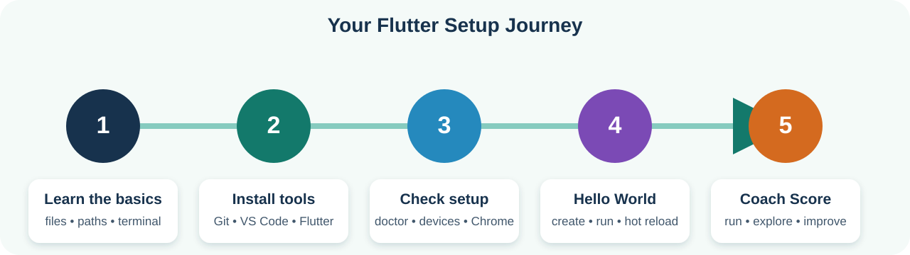
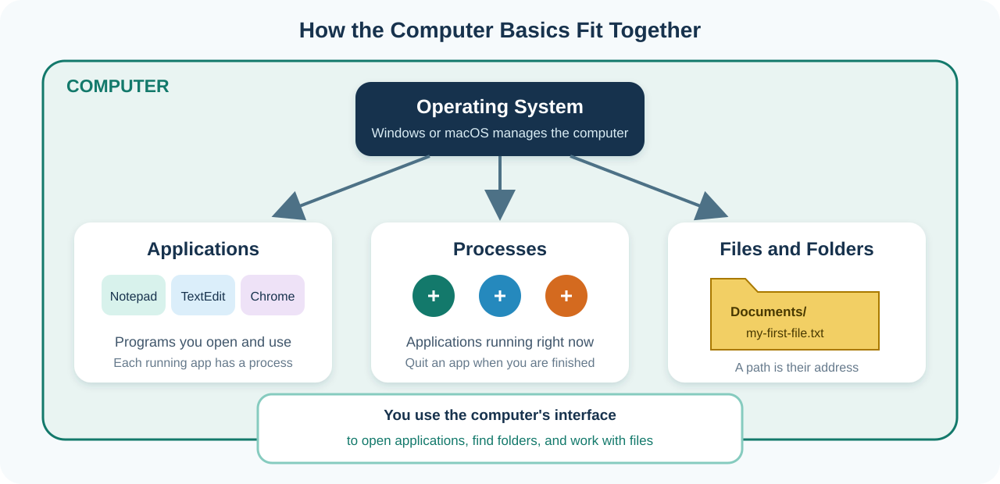
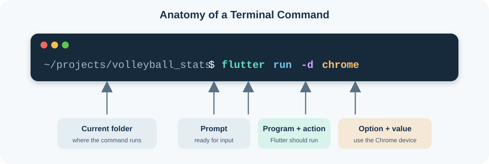

# Flutter Environment Setup for Students

This tutorial is for students who are new to software development. It explains
how to set up Flutter on Windows or macOS, install a code editor, create a first
app, and run Coach Score.

You do not need to understand every tool before starting. Follow the steps in
order and stop at each checkpoint to make sure your computer is ready.

## What You Will Accomplish

By the end of the required sections, you will:

- Understand basic computer and terminal vocabulary.
- Install Git, Visual Studio Code, Flutter, and Google Chrome.
- Learn how to open a terminal and run a command.
- Check your setup with `flutter doctor`.
- Create and run a small Hello World app.
- Open and run the Coach Score project.

Android and iOS setup are included later as optional next steps. For the first
class, everyone should run Flutter in Chrome. This is the shortest setup path on
both Windows and macOS.



*Follow the five steps from left to right. Each checkpoint prepares you for the
next step.*

## Before Class

Make sure you have:

- A Windows 10/11 PC or a reasonably recent Mac.
- A reliable internet connection.
- Several gigabytes of free disk space. Android Studio, Xcode, and device
  simulators need much more space than the basic web setup.
- Permission to install software. Ask a parent, teacher, or school IT team if
  your computer requires an administrator password.
- About 45 to 90 minutes for the basic setup. Downloads can make it take longer.

Do not install Flutter in a system-protected folder or a cloud-synchronized
folder. Good SDK locations are:

```text
Windows: C:\Users\your-name\develop\flutter
macOS:   /Users/your-name/development/flutter
```

Avoid locations such as `C:\Program Files`, OneDrive, iCloud Drive, or a folder
whose name contains unusual characters. Flutter needs to update files inside its
own folder.

## Four Words You Should Know

**Flutter** is the framework we use to create the app.

**Dart** is the programming language used by Flutter. The Flutter SDK already
contains Dart, so you do not install Dart separately.

**SDK** means Software Development Kit. It contains the commands and tools that
build and run a Flutter app.

**IDE** means Integrated Development Environment. It is the app in which you
read, write, run, and debug code. This class uses Visual Studio Code, usually
called VS Code.

The SDK and IDE are different. Installing the Flutter extension in VS Code does
not replace installing the Flutter SDK.

## Part 0: Computer Basics Before Flutter

Read this section before installing anything. You will use these ideas
throughout the tutorial.



*The operating system connects the applications you use, the processes that are
running, and the files stored on your computer.*

### Operating System

The **operating system**, or **OS**, is the main software that controls your
computer. It manages the screen, keyboard, files, memory, applications, and
connected devices.

This tutorial supports:

- **Windows**, made by Microsoft
- **macOS**, made by Apple

Windows and macOS can run many of the same development tools, but their screens,
keyboard shortcuts, paths, and terminal commands sometimes differ. Follow only
the instructions marked for your operating system.

How to check your operating system:

- Windows: open **Start > Settings > System > About**.
- macOS: open the **Apple menu > About This Mac**.

### Applications

An **application**, or **app**, is a program you can open and use. Chrome, VS
Code, Terminal, PowerShell, and Coach Score are all applications.

Applications usually have:

- An icon you can click.
- One or more windows.
- Menus, buttons, and settings.
- A process that runs while the application is open.

Installing an application copies its required files onto your computer. Opening
an application starts it. Closing its window usually stops it, although some
applications continue running in the background.

In this tutorial:

- **Chrome** displays and tests the Flutter web app.
- **VS Code** lets you read and edit project files.
- **PowerShell** on Windows or **Terminal** on macOS lets you type commands.

### Processes

A **process** is an application or command that is currently running.

For example, this command starts a Flutter process:

```sh
flutter run -d chrome
```

The process builds the app, starts a development server, opens Chrome, and waits
for more instructions. The terminal appears busy while that process is running.
You cannot type a new command at the normal prompt until you stop the process or
open another terminal.

For a running Flutter app:

- Press `r` to hot reload it.
- Press `R` to restart it.
- Press `q` to stop it normally.

For many other terminal processes, `Ctrl+C` asks the process to stop. Do not
close the entire computer or delete files just because a command is taking time.
Read the terminal message first.

### Files

A **file** is one saved piece of information. A file has a name and often a file
extension after a dot.

Examples from a Flutter project:

```text
README.md
pubspec.yaml
main.dart
```

The extension can give you a clue about the file:

- `.md`: Markdown documentation
- `.yaml`: structured configuration
- `.dart`: Dart source code

File extensions might be hidden by default. Do not add `.txt` to a code file
unless the instructions specifically ask for a text file.

### Folders and Directories

A **folder** holds files and other folders. Developers often use the word
**directory**, which means the same thing.

A Flutter project is a folder containing all the files and subfolders needed
for one app:

```text
volleyball_stats/
  README.md
  pubspec.yaml
  lib/
    main.dart
  test/
```

Here:

- `volleyball_stats` is the project folder.
- `lib` and `test` are folders inside it.
- `main.dart` is a file inside `lib`.

When opening Coach Score in VS Code, open the entire `volleyball_stats` folder,
not only `lib` or `main.dart`. VS Code and Flutter use `pubspec.yaml` to
recognize the project root.

### Paths

A **path** is the address of a file or folder on your computer.

Windows paths normally use a drive letter and backslashes:

```text
C:\Users\Jordan\projects\volleyball_stats
C:\Users\Jordan\projects\volleyball_stats\lib\main.dart
```

macOS paths normally begin with `/` and use forward slashes:

```text
/Users/Jordan/projects/volleyball_stats
/Users/Jordan/projects/volleyball_stats/lib/main.dart
```

An **absolute path** gives the complete address from the drive or computer root.
The examples above are absolute paths.

A **relative path** starts from your current folder. If your current folder is
`volleyball_stats`, this relative path identifies the same Dart file:

```text
lib/main.dart
```

Useful path symbols:

- `.` means the current folder.
- `..` means the parent folder, one level up.
- `~` on macOS means your user home folder.
- `$HOME` in PowerShell means your Windows user home folder.

Do not copy a sample path containing `Jordan` or `your-name` exactly. Replace
that part with your own computer user name.

### The Terminal and Shell

A **terminal** is an application that lets you control the computer by typing
text commands.

The **shell** reads the command, runs the correct program, and prints the result.
For this tutorial:

- Windows students use **PowerShell**.
- macOS students use the default shell inside **Terminal**.
- VS Code can display either shell in its built-in terminal panel.

Opening a terminal does not change your files by itself. A change happens only
after you run a command that creates, edits, moves, or deletes something.

You might see a prompt similar to:

Windows PowerShell:

```text
PS C:\Users\Jordan\projects>
```

macOS:

```text
Jordan@MacBook projects %
```

The prompt shows that the shell is ready. Type the command after the prompt. Do
not copy the example's `PS`, `>`, `%`, or `$` prompt symbol.

### Commands and Arguments

A terminal instruction usually contains a **command** followed by one or more
**arguments**.

Example:

```sh
flutter run -d chrome
```



- `flutter` is the program.
- `run` tells Flutter what action to perform.
- `-d` means that the next value identifies a device.
- `chrome` is the device value.

Spaces separate these pieces. Spelling, capitalization, dashes, and spaces
matter.

Run one command at a time. Read its output before continuing. A command might:

- Finish successfully and return to the prompt.
- Print a warning but still finish.
- Print an error and stop.
- Keep running until you stop it.

### Your Current Folder

Every terminal has a **current working directory**, also called the current
folder. Commands normally act on that folder.

To show your current folder:

Windows PowerShell:

```powershell
Get-Location
```

macOS:

```sh
pwd
```

To list what is inside the current folder:

Windows PowerShell:

```powershell
Get-ChildItem
```

macOS:

```sh
ls
```

To enter a folder on either system:

```sh
cd volleyball_stats
```

To move up one folder:

```sh
cd ..
```

Before running a Flutter project command, confirm that the current folder
contains `pubspec.yaml`.

### Practice Before Installing Flutter

Open PowerShell on Windows or Terminal on macOS and complete this safe exercise.

#### Windows PowerShell

```powershell
cd $HOME
mkdir student_terminal_practice -ErrorAction SilentlyContinue
cd student_terminal_practice
Get-Location
Get-ChildItem
cd ..
```

#### macOS

```sh
cd
mkdir -p student_terminal_practice
cd student_terminal_practice
pwd
ls
cd ..
```

What happened:

1. You moved to your user home folder.
2. You created a folder named `student_terminal_practice`.
3. You entered that folder.
4. You displayed its path and contents.
5. You returned to its parent folder.

You can leave the practice folder on your computer. It is empty and harmless.

### Basic Safety Rules

- Read a command before pressing Enter.
- Do not run commands from an unknown person or website.
- Do not use administrator privileges unless the tutorial or your teacher
  explains why they are needed.
- Do not share passwords, access tokens, or other secret values.
- Do not delete a file or folder unless you know what it contains.
- Stop and ask for help when a command refers to a different folder than the one
  you expected.
- Copy error text when asking for help, but remove private information first.

### Computer Basics Checkpoint

Before continuing, make sure you can explain:

- Which operating system you use.
- The difference between an application and a running process.
- The difference between a file and a folder.
- What a path tells you.
- What the terminal does.
- How to display and change your current folder.
- Why the project folder must contain `pubspec.yaml`.

## Part 1: Choose Your Computer

Follow only the section for your operating system:

- [Windows setup](#windows-setup)
- [macOS setup](#macos-setup)

After completing that section, everyone continues at
[Part 2: Check Your Installation](#part-2-check-your-installation).

# Windows Setup

Use regular Windows for this tutorial. Do not put the Flutter SDK or project
inside WSL for the beginner setup. Flutter's Windows tools, Chrome, and Android
emulator work most predictably when the files are on the Windows side.

## Windows Step 1: Install Google Chrome

1. Open [Google Chrome's download page](https://www.google.com/chrome/).
2. Download the Windows installer.
3. Open the downloaded installer and complete the instructions.
4. Start Chrome once to make sure it works.

Flutter will use Chrome as the first practice device.

## Windows Step 2: Install Git

Git downloads projects and keeps a history of code changes.

1. Open [Git for Windows](https://git-scm.com/download/win).
2. Download and run the installer.
3. Keep the default choices unless your teacher gives you different
   instructions.
4. Finish the installation.

## Windows Step 3: Install VS Code

1. Open the [VS Code download page](https://code.visualstudio.com/Download).
2. Download **User Installer** for your computer. Most Windows computers use
   **x64**. Windows on ARM computers use **Arm64**.
3. Run the installer.
4. If the installer offers these choices, select them:
   - Add "Open with Code" action.
   - Add to PATH.
   - Register Code as an editor for supported file types.
5. Finish the installation and open VS Code.

## Windows Step 4: Install the Flutter Extension

1. In VS Code, click the **Extensions** icon on the left. It looks like four
   blocks.
2. Search for `Flutter`.
3. Select the extension named **Flutter** and published by **Dart Code**.
4. Click **Install**.
5. Allow VS Code to install the Dart extension when prompted.

## Windows Step 5: Download the Flutter SDK From VS Code

1. In VS Code, open **View > Command Palette**.
2. You can also press `Ctrl+Shift+P`.
3. Type `Flutter: New Project` and select it.
4. When VS Code asks for the Flutter SDK, select **Download SDK**.
5. Select this parent folder:

   ```text
   C:\Users\your-name\develop
   ```

   You may need to create the `develop` folder. Use your real Windows user name
   in place of `your-name`.

6. Click **Clone Flutter**.
7. Wait for the download to finish. Do not close VS Code.
8. When prompted, click **Add SDK to PATH**.
9. If VS Code continues to ask for a project template or project name, press
   `Escape`. You will create the practice project in Part 3.
10. Close every VS Code and PowerShell window, then reopen VS Code. Programs need
   to restart before they can see the new PATH setting.

### Windows Checkpoint

Open a new terminal in VS Code:

1. Select **Terminal > New Terminal**.
2. At the bottom of VS Code, make sure the terminal is PowerShell.
3. Run:

```powershell
flutter --version
dart --version
git --version
```

Each command should print a version. It should not say that the command is
unknown or not recognized.

If all three work, continue to
[Part 2: Check Your Installation](#part-2-check-your-installation).

# macOS Setup

These instructions work on Apple Silicon Macs and Intel Macs. The VS Code
installer and Flutter setup should choose the correct download for your Mac.

## macOS Step 1: Install Google Chrome

1. Open [Google Chrome's download page](https://www.google.com/chrome/).
2. Download the macOS installer.
3. Open the downloaded `.dmg` file.
4. Drag Chrome into the **Applications** folder.
5. Open Chrome once to make sure it works.

## macOS Step 2: Install Apple's Command-Line Tools

The command-line tools include Git and other programs Flutter needs.

1. Open **Terminal**. You can press `Command+Space`, type `Terminal`, and press
   Return.
2. Run:

```sh
xcode-select --install
```

3. If a dialog opens, click **Install** and wait for it to finish.
4. If Terminal says the tools are already installed, that is also success.

You do not need the full Xcode application for the first Chrome lesson.

## macOS Step 3: Install VS Code

1. Open the [VS Code download page](https://code.visualstudio.com/Download).
2. Download the macOS build for your Mac.
3. Open the downloaded archive if it does not open automatically.
4. Drag **Visual Studio Code** into the **Applications** folder.
5. Open VS Code.
6. If macOS asks whether you trust the downloaded application, confirm that you
   want to open it.

## macOS Step 4: Install the Flutter Extension

1. In VS Code, click the **Extensions** icon on the left. It looks like four
   blocks.
2. Search for `Flutter`.
3. Select the extension named **Flutter** and published by **Dart Code**.
4. Click **Install**.
5. Allow VS Code to install the Dart extension when prompted.

## macOS Step 5: Download the Flutter SDK From VS Code

1. Open **View > Command Palette** in VS Code.
2. You can also press `Command+Shift+P`.
3. Type `Flutter: New Project` and select it.
4. When VS Code asks for the Flutter SDK, select **Download SDK**.
5. Select or create this parent folder:

   ```text
   /Users/your-name/development
   ```

   Use your real macOS user name in place of `your-name`.

6. Click **Clone Flutter**.
7. Wait for the download to finish. Do not close VS Code.
8. When prompted, click **Add SDK to PATH**.
9. If VS Code continues to ask for a project template or project name, press
   `Escape`. You will create the practice project in Part 3.
10. Close every VS Code and Terminal window, then reopen VS Code. Programs need
   to restart before they can see the new PATH setting.

### macOS Checkpoint

Open a new terminal in VS Code:

1. Select **Terminal > New Terminal**.
2. Run:

```sh
flutter --version
dart --version
git --version
```

Each command should print a version. It should not say `command not found`.

# Part 2: Check Your Installation

In the VS Code terminal, run:

```sh
flutter doctor -v
```

`flutter doctor` checks your computer and reports what is ready.

For the first lesson, look for:

```text
[✓] Flutter
[✓] Chrome
[✓] VS Code
[✓] Network resources
```

Your exact list may look different.

It is okay to see a warning for Android Studio if you have not completed the
optional Android section. It is okay to see Xcode or iOS warnings on macOS
before completing the optional iOS section. Windows cannot build iOS apps, so an
iOS option will not appear there.

Next, run:

```sh
flutter devices
```

Look for a device containing `Chrome` and `web`. Microsoft Edge can also run a
Flutter web app on Windows, but the class examples use Chrome.

## Setup Checkpoint

You are ready for the first app when:

- `flutter --version` works.
- `flutter doctor -v` recognizes Flutter, Chrome, and VS Code.
- `flutter devices` lists Chrome.

# Part 3: Create a Hello World App

Now you will create a small app. Commands must be typed exactly, including
spaces. Do not type the `$` or `>` symbols sometimes shown in online examples;
those symbols only represent the terminal prompt.

## Step 1: Choose a Projects Folder

In the VS Code terminal, run the commands for your operating system.

Windows PowerShell:

```powershell
cd $HOME
mkdir projects -ErrorAction SilentlyContinue
cd projects
```

macOS:

```sh
cd
mkdir -p projects
cd projects
```

`cd` means "change directory." A directory is another name for a folder.

## Step 2: Ask Flutter to Create the App

Run:

```sh
flutter create --empty hello_flutter
cd hello_flutter
```

Project names use lowercase letters and underscores. Do not use a space in a
Flutter project name.

Flutter creates several folders. The most important file for this exercise is:

```text
lib/main.dart
```

## Step 3: Open the Project in VS Code

Run:

```sh
code .
```

The dot means "this folder."

If `code` is not recognized, use VS Code's **File > Open Folder** command and
select the `hello_flutter` folder inside your `projects` folder.

Always open the project folder that contains `pubspec.yaml`. Opening only the
`lib` folder prevents some Flutter tools from working correctly.

## Step 4: Replace `lib/main.dart`

1. In the VS Code Explorer on the left, open the `lib` folder.
2. Open `main.dart`.
3. Select everything in that file.
4. Replace it with:

```dart
import 'package:flutter/material.dart';

void main() {
  runApp(const HelloApp());
}

class HelloApp extends StatelessWidget {
  const HelloApp({super.key});

  @override
  Widget build(BuildContext context) {
    return MaterialApp(
      debugShowCheckedModeBanner: false,
      home: Scaffold(
        appBar: AppBar(
          title: const Text('My First Flutter App'),
        ),
        body: const Center(
          child: Text(
            'Hello, Flutter!',
            style: TextStyle(fontSize: 32),
          ),
        ),
      ),
    );
  }
}
```

5. Save the file with `Ctrl+S` on Windows or `Command+S` on macOS.

Do not worry if you do not understand every line yet. The code says:

- Start a Flutter app.
- Create a page with a top app bar.
- Put the words "Hello, Flutter!" in the center.

## Step 5: Run the App

Make sure your terminal is inside the `hello_flutter` folder, then run:

```sh
flutter run -d chrome
```

The first run may take several minutes. Flutter should open a Chrome window that
shows your app.

If Chrome does not open automatically, read the terminal for an error before
trying the troubleshooting section.

## Step 6: Try Hot Reload

Keep the app running.

1. Change this text in `lib/main.dart`:

   ```dart
   'Hello, Flutter!'
   ```

   to:

   ```dart
   'Hello, Coach Score Team!'
   ```

2. Save the file.
3. If the app does not refresh automatically, click the terminal and press `r`.

The running app should change without completely restarting. This feature is
called **hot reload**.

In the terminal:

- Press `r` to hot reload.
- Press `R` to restart the app.
- Press `q` to stop the app.

## Step 7: Check the Code

Stop the app with `q`, then run:

```sh
dart format .
flutter analyze
flutter test
```

What these commands do:

- `dart format .` makes Dart code consistently readable.
- `flutter analyze` finds many code mistakes without running the app.
- `flutter test` runs automated tests. A project created with `--empty` reports
  that its `test` folder was not found; that is expected for this small exercise,
  because you have not written a test yet.

## Hello World Completion Check

You have completed the first app when:

- Chrome displays your message.
- You can change the message and hot reload.
- `flutter analyze` reports no issues.
- You know how to stop the running app with `q`.

# Part 4: Run Coach Score

Coach Score is the real Flutter project used in this class.

## Step 1: Get the Project

If your teacher has already given you a Coach Score folder, skip to Step 2.

Otherwise, open a terminal and go to your projects folder:

Windows PowerShell:

```powershell
cd $HOME\projects
```

macOS:

```sh
cd ~/projects
```

Clone the project:

```sh
git clone https://github.com/rising-stars-v/volleyball_stats.git
cd volleyball_stats
```

If Git asks you to sign in or says the repository cannot be found, ask your
teacher whether your GitHub account has access.

## Step 2: Open the Correct Folder

From inside the project folder, run:

```sh
code .
```

Confirm that the VS Code Explorer shows `pubspec.yaml`, `lib`, `test`, and
`README.md`.

## Step 3: Download Project Packages

Run:

```sh
flutter pub get
```

A package is reusable code that the project depends on. Flutter reads the
package list from `pubspec.yaml`.

## Step 4: Run Coach Score

Run:

```sh
flutter run -d chrome
```

Try this walkthrough:

1. Open the roster.
2. Start or resume a match.
3. Select a player.
4. Record an action.
5. Undo an action.
6. Open the match summary.

Stop the app with `q`.

## Step 5: Verify the Project

Run:

```sh
dart format .
flutter analyze
flutter test
```

The existing project tests should pass. If a command fails, copy the first
useful error message and ask your teacher for help.

# Optional Part 5: Set Up Android

Complete this section only after the Chrome version works. Android development
requires Android Studio even if you continue writing code in VS Code.

## Install Android Studio

1. Download the latest stable
   [Android Studio](https://developer.android.com/studio).
2. Run the installer.
3. Keep the Android SDK, Android SDK Platform, and Android Virtual Device
   components selected.
4. Open Android Studio and finish its Setup Wizard.

## Check Android SDK Tools

1. On the Android Studio welcome screen, select **More Actions > SDK Manager**.
   With a project open, use **Tools > SDK Manager**.
2. On **SDK Platforms**, install a current Android SDK platform.
3. On **SDK Tools**, make sure these are installed:
   - Android SDK Build-Tools
   - Android SDK Command-line Tools
   - Android Emulator
   - Android SDK Platform-Tools
4. Click **Apply** and wait for installation to finish.

## Accept Android Licenses

Close and reopen your terminal, then run:

```sh
flutter doctor --android-licenses
```

Read each license and type `y` if you agree.

Run:

```sh
flutter doctor -v
```

The Android toolchain section should now be ready.

## Create an Android Emulator

1. In Android Studio, open **More Actions > Virtual Device Manager** from the
   welcome screen, or **Tools > Device Manager** from a project.
2. Click the **+** button and choose **Create Virtual Device**.
3. Choose a common phone model.
4. Choose and download a recommended system image.
5. If asked to choose an image architecture, use x86_64 for most Intel/AMD
   Windows computers and ARM64 for Apple Silicon Macs.
6. Finish the wizard.
7. Click the Run triangle beside the new virtual device.

Wait until the virtual phone finishes starting, then run:

```sh
flutter devices
```

An Android device should appear. From the Coach Score folder, you can run:

```sh
flutter run
```

If more than one device is available, Flutter asks you to choose one. You can
also use the device picker in the lower-right corner of VS Code.

# Optional Part 6: Set Up iOS on macOS

iOS apps can be built only on macOS. Complete the Chrome setup first. Xcode and
the iOS Simulator are large downloads.

## Install and Prepare Xcode

1. Install the latest Xcode from the Mac App Store.
2. Open Xcode once and allow it to install additional components.
3. In Terminal, run:

```sh
sudo sh -c 'xcode-select -s /Applications/Xcode.app/Contents/Developer && xcodebuild -runFirstLaunch'
sudo xcodebuild -license
xcodebuild -downloadPlatform iOS
```

The first two commands may ask for your macOS password. Terminal does not show
dots or stars while you type the password; this is normal. Read and accept the
licenses only if you agree.

Some Flutter projects use native plugins that also require CocoaPods. If
`flutter doctor` says CocoaPods is missing, follow the current
[Flutter iOS setup guide](https://docs.flutter.dev/platform-integration/ios/setup)
or ask your teacher for help before installing it.

## Start the iOS Simulator

Run:

```sh
open -a Simulator
flutter devices
```

An iPhone Simulator should appear in the device list. From the Coach Score
folder, run:

```sh
flutter run
```

Choose the simulator when Flutter asks for a device.

You do not need a paid Apple Developer membership to run the iOS Simulator.
Physical-device signing and App Store publishing are separate, later tasks.

# Optional Part 7: Use Android Studio or IntelliJ as the IDE

The class examples use VS Code, but Flutter also supports Android Studio and
IntelliJ IDEA.

1. Open the IDE's settings:
   - Windows: **File > Settings**
   - macOS: **Android Studio/IntelliJ IDEA > Settings**
2. Select **Plugins > Marketplace**.
3. Search for `Flutter`.
4. Install the Flutter plugin and accept the Dart plugin dependency.
5. Restart the IDE.
6. Open the project folder containing `pubspec.yaml`.
7. If asked for the Flutter SDK path, choose the SDK root:

   ```text
   Windows: C:\Users\your-name\develop\flutter
   macOS:   /Users/your-name/development/flutter
   ```

Do not select the SDK's `bin` folder. The correct selection is the `flutter`
folder that contains `bin`.

# Troubleshooting

## `flutter` Is Not Recognized or Is Not Found

Close and reopen all terminals and IDE windows, then try:

```sh
flutter --version
```

If it still fails:

1. Open the VS Code Command Palette.
2. Run **Flutter: Change SDK** or **Flutter: Locate SDK**.
3. Select the Flutter SDK root, not its `bin` folder.
4. Use Flutter's official
   [PATH instructions](https://docs.flutter.dev/install/add-to-path) if VS Code
   did not add it automatically.

## VS Code Says It Cannot Find the Flutter SDK

Select the folder named `flutter`, for example:

```text
C:\Users\your-name\develop\flutter
/Users/your-name/development/flutter
```

Do not select:

```text
...\flutter\bin
```

## `flutter doctor` Shows Warnings

Read the heading beside the warning.

- Android warning: complete the optional Android section only if you need
  Android now.
- Xcode or iOS warning: relevant only on a Mac when you need iOS.
- Visual Studio warning on Windows: Visual Studio is a separate Microsoft
  product used for Windows desktop apps. It is not required for Chrome or
  Android, and it is not the same as VS Code.

You do not need every `flutter doctor` line to be green before running in
Chrome.

## Chrome Does Not Appear in `flutter devices`

1. Make sure Chrome is installed and opens normally.
2. Close and reopen VS Code.
3. Run:

```sh
flutter devices
```

On Windows, Edge can be used temporarily:

```sh
flutter run -d edge
```

## PowerShell Blocks a Script

Do not change security settings without understanding the change. Copy the
complete error and ask your teacher or school IT team for help. On a managed
school computer, security policy might prevent students from changing it.

## Android `cmdline-tools` Is Missing

In Android Studio:

1. Open **Tools > SDK Manager**.
2. Open **SDK Tools**.
3. Select **Android SDK Command-line Tools**.
4. Click **Apply**.
5. Run `flutter doctor -v` again.

## A Download Fails at School

School networks sometimes block GitHub, Google storage, package servers, or
simulator downloads. Save the exact error. Ask the teacher or IT team whether
the required site is blocked. Do not paste passwords, access tokens, or private
account information into a class chat or an AI tool.

## The App Runs but Does Not Show a Recent Change

Try these in order:

1. Save the file.
2. Press `r` in the terminal for hot reload.
3. Press `R` for a full hot restart.
4. Stop with `q` and run the app again.

## How to Ask for Help

Copy this template and fill it in:

```text
Operating system:
Step I was following:
Command I ran:
What I expected:
What happened:
First error message:
What I already tried:
```

Do not send a screenshot that includes passwords, tokens, email addresses, or
other private information.

# First-Day Completion Checklist

- [ ] Chrome opens.
- [ ] Git is installed.
- [ ] VS Code opens.
- [ ] The Flutter and Dart extensions are installed.
- [ ] `flutter --version` works.
- [ ] `flutter doctor -v` recognizes Flutter, Chrome, and VS Code.
- [ ] `flutter devices` lists Chrome.
- [ ] The Hello World app runs in Chrome.
- [ ] Hot reload changes the message.
- [ ] Coach Score runs in Chrome.
- [ ] `flutter analyze` passes in Coach Score.
- [ ] `flutter test` passes in Coach Score.

# Official References

Use current official instructions if a screen has changed since this tutorial
was written:

- [Install Flutter with VS Code](https://docs.flutter.dev/install/with-vs-code)
- [Set up Flutter for the web](https://docs.flutter.dev/platform-integration/web/setup)
- [Use Flutter in VS Code](https://docs.flutter.dev/tools/vs-code)
- [Create a new Flutter app](https://docs.flutter.dev/reference/create-new-app)
- [Set up Android development](https://docs.flutter.dev/platform-integration/android/setup)
- [Set up iOS development](https://docs.flutter.dev/platform-integration/ios/setup)
- [Flutter installation troubleshooting](https://docs.flutter.dev/install/troubleshoot)

After setup, continue with the
[GitHub Copilot Setup for Students](../09-copilot-setup-and-safety.md) if your
class uses AI coding tools. Then continue with the
[Coach Score Student HCI Tutorial](../07-observe-coach-score.md).
